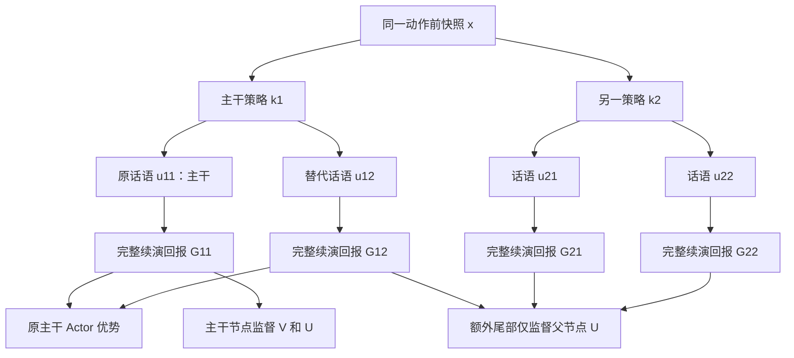
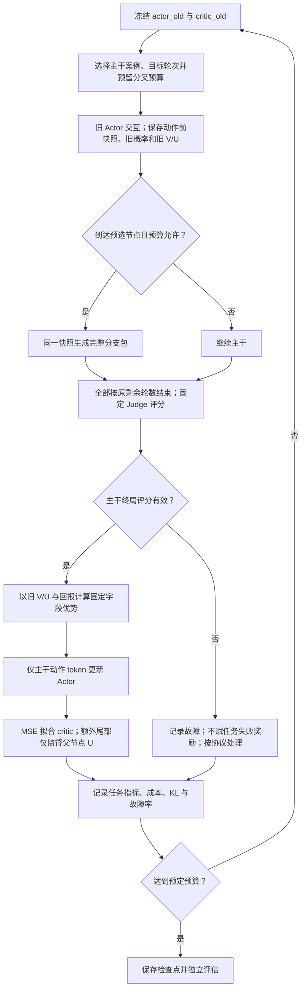

# CSTPO 算法概览

> 2026-09-13 复审：当前实施入口为 [实施规范与审查结论 v1](03_CSTPO实施规范.md)。其状态定义、概率/KL、critic 监督、分支用途及正式实验约束优先；本文件保留补充细节，不能单独视为已通过运行与创新验收。

原稿日期：2026-09-13；公式与流程图更新：2026-09-14。下述原型状态描述属于原稿，最新实施进展见 [UPDATEME](UPDATEME.md)。状态：可实施设计草案，尚未实现 RL 训练，也没有新增模型实验。此前的 36 分支仅为模拟器诊断。

公式采用 Markdown 的 `$...$` 与 `$$...$$`，图采用 Mermaid；请使用支持数学与 Mermaid 的预览器。算法约定保持与 03 一致。

## 1. 本版固定的选择

- 主路线：带字段 mask 的 PPO，不同时引入 DPO。
- Actor：仅对话历史及自身角色合法可见的任务信息；输出策略标签 k 与话语 u。
- 终局任务回报：ESConv 双维度 judge；P4G 明确捐赠承诺；bargain 成交与己方价格收益。评分协议先试标并固定。角色和未成交回报、异常价格处理须在任务适配器中明确。
- 首版 gamma=1，非终局外部奖励为 0，不加每轮长度惩罚。最大轮数是任务协议的一部分；默认可先用 8 个 assistant-user 回合作工程试跑，不视为 ESConv 的最佳长度。
- 分叉：每条入选主干最多一个分叉节点，该处共两策略、每策略两措辞，随后全部续演至同一终局协议。一次主干已有的原动作算四个分支之一，额外生成三个尾部。
- Actor 只用完整主干上的原始动作更新；额外尾部用于分支比较和 critic 训练。暂不把自适应收集的全部树节点直接混进 PPO。
- 不从第一批数据开始依赖浅分支 bootstrap；敏感度预测器与自适应调度留待原有待验证问题通过后引入。

记 $o_t$ 为对话历史及 Actor 自己合法可见的任务信息，$x_t$ 为动作前训练侧状态，$k_t$ 为策略，$u_t$ 为话语：

$$
\pi_\theta(k_t,u_t\mid o_t)
=\pi_\theta(k_t\mid o_t)\,\pi_\theta(u_t\mid o_t,k_t).
$$

$$
J(\theta)=\mathbb E_{z\sim\mathcal D,\tau\sim(\pi_\theta,\mathrm{CogSim}\mid z)}[G(\tau)],
\qquad \gamma=1,\quad r_t=0\;(t<T),\quad r_T=G(\tau).
$$

$z$ 是初始种子，$\tau$ 是完整对话，$T$ 是实际终止回合。终局回报由任务协议定义，不能用认知变化幅度替代。Actor 不读取隐藏的 $x_t$ 字段。

## 2. 环境接口和字段约定

每个动作前保存完整 checkpoint：UserState（含 history、profile、BDI、Emotion）、prev_gc、conversation_ended、route_mode、debug，以及剩余回合数。日志可以独立存储，不必深拷贝网络客户端。每个分支共享模型版本，使用独立可变状态；首版路由 deterministic，模型输出仍允许后端非确定性。

父状态必须是 Agent 发出动作前的状态；不能从已经吸收原动作后的状态产生替代动作。只有话语传给 Cog-Sim，不把策略标签直接告诉用户模拟器。judge 仅看完整对话和任务评价所需的案例信息，不看 BDI、Emotion 或 critic 预测。

先修复并回归 UPDATEME 中已记录的初始化、更新预算、激活/容量、非法字段问题，形成有独立版本指纹的修复版本。模拟器校验失败时丢弃并统计失败原因；合法拒绝、失败任务与有效零变化必须保留。

Actor 的策略字段使用固定枚举。实现可以使用单独特殊 token，或有限标签字符串的约束解码；若用特殊 token，须显式训练新增 embedding/output 参数，不能仅训练 LoRA 后假定新 token 已学会。策略有多个 token 时，mask 覆盖完整标签。

策略采样和旧策略 logprob 使用同一个合法标签分布。话语分布也保存实际采样参数，首版避免 top-k/top-p 截断与训练概率不一致。生成应有随机性，否则两个措辞可能完全相同；合法重复保留，不能为制造优势强制重采样。

## 3. 一批采样的具体账本

工程起始配置：64 条完整主干，预先随机指定其中 4 条允许分叉；每条预先抽取一个目标轮次。若目标轮次未到就结束，该条跳过，不根据最终成功与否或对话长度另行补选。

在入选节点，主干动作 k1,u11 已确定后，从旧 Actor 在相同历史和 k1 条件下独立采样 u12。再从其他合法策略中按旧 Actor 概率归一化采样 k2，并独立生成 u21、u22。每个尾部都用冻结的旧 Actor 继续交互，终局 judge 与主干相同。

记录 k2 的条件采样概率。额外 k2 分支不是普通 on-policy Actor 样本；本版不拿它更新 Actor，因此不需要为它构造 Actor 的离策略修正。

最多额外 12 个尾部。若每条主干上限为 T 轮，额外模拟回合上限为 12T，而主干容量上限为 64T；这是容量比 18.75%，不是实际 token 开销比例。实际主干可能提前结束，长历史调用更贵，不同模式调用数不同，所有成本必须实测。

设置额外采样 token 预算上限。优先预留一个完整分支包的预算，完成预算允许的包；不能只保留先成功的尾部。若出现部分包，统计为不完整，不用其均值产生策略分支优势。完成的主干仍可按普通方式训练。比较基线须用等总 token/时间预算，不能固定主干数后忽略额外尾部。

图中 G12 仅帮助估计原策略标签优势，其话语 token 不进入 Actor loss；G21/G22 也不更新 Actor。分叉从同一父快照独立续演，不重置剩余轮数。

### 3.1 高效采样由三层机制组成

当前可直接实施的是第一层；第二、三层必须通过对应预实验后才能启用，不能在方法描述中写成已经验证有效。

**第一层：稀疏完整分叉。** 每批 64 条主干只预选最多 4 条轨迹，每条轨迹最多一个候选节点。一个 $2\times2$ 包复用已有主干 $(k_1,u_{11},G_{11})$，因此只增加三个尾部，而不是重新生成四条完整轨迹：

$$
N_{\mathrm{extra}}=B_{\mathrm{branch}}(2\times2-1)=3B_{\mathrm{branch}},
\qquad B_{\mathrm{branch}}\leq 4.
$$

这里节省的是重复生成共同前缀及第四条尾部的成本。额外尾部仍可能很贵，所以是否高效必须用包括 Cog-Sim、Judge 和重试在内的实际 token／时间曲线验证，不能由 $3/4$ 复用比例直接推出。

**第二层：认知敏感度调度（P4/P7 通过后启用）。** 先用独立探测数据训练低容量预测器 $\widehat S_\psi(x_t)$。它只读取动作前状态，不需要在正式采样时先生成多个策略来计算真实敏感度。用开发集经验分布 $F_{\mathrm{dev}}$ 将预测转换为分位数：

$$
s_t=F_{\mathrm{dev}}\!\left(\widehat S_\psi(x_t)\right)\in[0,1].
$$

当前保守协议在每条主干开始前，从 $1,\ldots,H$ 均匀抽取一个候选轮次 $t^*$；到达该轮且预算足够时，在生成当前动作之前决定是否建立分叉包：

$$
t^*\sim\mathrm{Uniform}\{1,\ldots,H\},
$$

$$
p_{\mathrm{branch}}(x_{t^*})
=\min\left\{1,\max\left\{0,
c\left(0.5+0.5s_{t^*}\right)
\right\}\right\}.
$$

$c$ 只用开发数据校准，使预期分叉数满足预算：

$$
\sum_i p_{\mathrm{branch}}(x_i)\leq B_{\mathrm{branch}}.
$$

这个规则把高敏感度候选的入选概率提高到低敏感度候选的至多两倍，同时始终保留探索概率。随机对照使用相同预算下的常数概率。每次必须记录候选轮次、$s_t$、选择概率、预算是否可用和实际选择结果。

如果加入价值不确定性分位数 $q_t\in[0,1]$，当前候选组合是等权和，而不是未经验证的乘积：

$$
a_t^{\mathrm{combined}}=\frac{s_t+q_t}{2}.
$$

随后在分叉概率中用 $a_t^{\mathrm{combined}}$ 替换 $s_t$。正式比较包括随机、仅 $q_t$、仅 $s_t$、以及二者组合；只有认知敏感度方案在成本计全后优于仅不确定性，才构成认知驱动高效采样的证据。

**第三层：浅续演与 bootstrap（P6 通过后可选）。** 完整尾部经过 $h$ 步后，用冻结旧 critic 估计剩余价值：

$$
\widehat Q_h=\sum_{i=0}^{h-1}r_{t+i}+V_{\mathrm{old}}(x_{t+h}).
$$

首版中间奖励为零，所以非终局截断时 $\widehat Q_h=V_{\mathrm{old}}(x_{t+h})$；若在 $h$ 步内真实终止，则使用终局 $G$ 且后继价值为零。只有它相对独立完整续演保持动作排序并实际降低至少预注册的采样成本时才上线。

因此，当前版本的效率主张应写成两级：稀疏完整分叉是已定义的采样机制；认知敏感度预测与浅 bootstrap 是有明确接口和退出条件的候选增强。前者能否优于增加普通主干、后两者能否进一步节省预算，都仍需实验回答。

## 4. critic：一个模型，两种价值输出

训练输入 x 包含历史、固定 Persona、用户角色 KB、BDI 节点文本及属性、Emotion、用户参数、prev_gc、任务事件状态和剩余回合数。仅输入数值强度无法区分节点含义。

独立于 Actor 的 critic 编码器输出 V(x) 和 U(x,k)。可实现为共享编码器、一个标量 V head，以及每任务合法策略对应的 U 向量；只监督本条数据实际采样到的策略维度。

V(x) 预测旧策略下的终局期望回报；U(x,k) 预测选定 k、后续措辞及对话按旧策略生成时的终局期望回报。U 不能读取当前要评分的话语 u 或其之后的状态。

首版用完整终局回报 G 作监督：V 用主干样本；U 用主干和完整分支样本。固定包内权重，避免有分叉的父状态因复制记录获得未记录的更大权重。v1 固定 MSE 以对应条件期望目标；额外尾部仅监督分叉父节点 U；不把未采样策略当作零回报。

每批开始冻结旧 Actor 和旧 critic。所有用于本批 Actor 优势的 V_old、U_old 必须由冻结版本产生，再拟合 critic；不能先拟合本批回报再用过拟合后的预测消掉本批优势。

预热：先用冻结 SFT Actor 收集完整对话训练 critic，留出独立用户检查其回报误差。预测不足时也可训练 Actor：V/U 仅作基线，但不能据此宣称已经实现可靠的条件归因或开启浅分支截断。

$$
V^{\pi_{\mathrm{old}}}(x)=\mathbb E_{\pi_{\mathrm{old}}}[G\mid x],
\qquad
U^{\pi_{\mathrm{old}}}(x,k)=\mathbb E_{\pi_{\mathrm{old}}}[G\mid x,k].
$$

令 $\mathcal D$ 为主干节点集合，$\mathcal B$ 为完整分叉父节点集合，$\mathcal E_{b,i}$ 为父节点 $b$ 的第 $i$ 个策略下的额外尾部。完整包中 $\mathcal E_{b,1}=\{12\}$、$\mathcal E_{b,2}=\{21,22\}$。critic 参数记为 $\phi$，其 MSE 为：

$$
\begin{aligned}
\mathcal L_{\mathrm{main}}(\phi)
&=\frac{1}{|\mathcal D|}\sum_{(x,k,G)\in\mathcal D}
\left[(V_\phi(x)-G)^2+(U_\phi(x,k)-G)^2\right],\\
\mathcal L_{\mathrm{extra}}(\phi)
&=\frac{1}{|\mathcal B|}\sum_{b\in\mathcal B}\frac12\sum_{i=1}^2
\frac{1}{|\mathcal E_{b,i}|}\sum_{v\in\mathcal E_{b,i}}
(U_\phi(x_b,k_{b,i})-G_{b,v})^2,\\
\mathcal L_{\mathrm{critic}}(\phi)
&=\mathcal L_{\mathrm{main}}(\phi)+0.25\,\mathcal L_{\mathrm{extra}}(\phi).
\end{aligned}
$$

没有完整包时额外项为零。G11 已计入主干项，不再重复放入额外项；未采样策略没有零标签。先算本批旧基线，再拟合本批回报。旧 critic 可能有策略滞后，不等于当前策略的精确条件期望。

## 5. 实际可计算的两个字段优势

设原始主干的终局回报为 G11。普通主干节点：

$$
\begin{aligned}
\widehat A^{\mathrm{strategy}}&=G_{11}-V_{\mathrm{old}}(x),\\
\widehat A^{\mathrm{utterance}}&=G_{11}-U_{\mathrm{old}}(x,k_1).
\end{aligned}
$$

对完成了同策略替代措辞尾部的分叉节点，设其独立回报为 G12：

$$
\begin{aligned}
\widehat A^{\mathrm{strategy}}&=\frac{G_{11}+G_{12}}{2}-V_{\mathrm{old}}(x),\\
\widehat A^{\mathrm{utterance}}&=G_{11}-U_{\mathrm{old}}(x,k_1).
\end{aligned}
$$

解释：策略优势在有分支时对两个同策略实现取均值，减少把策略优劣等同于某一个措辞效果；原话语优势对比冻结的策略条件基线。给原标签更新一次，不因两个措辞复制两次标签 loss。额外 k2 的结果用于训练 U 和评估策略间分歧。

这是一组可实现的优势估计器，不是强制满足逐样本加和的奖励切分。理想条件价值分解为 (U-V) 与 (Q-U)；上述 G-V 在条件期望上估计 U-V，分叉均值进一步估计该期望。在准确回报、按策略采样及动作独立基线等条件下可解释原始 score-function 梯度；token PPO clipping、有限样本与近似 critic 的实际收益仍需实验，不宣称完整 PPO 更新无偏。

首版不要用 U_old-V_old 完全替代有终局样本依据的策略优势；也不要要求两个措辞的差异一定显著，用户模拟噪声尚未被两个样本消除。

理想分解中 $Q^\pi(x,k,u)=\mathbb E_\pi[G\mid x,k,u]$，因此：

$$
Q^\pi(x,k,u)-V^\pi(x)
=\underbrace{U^\pi(x,k)-V^\pi(x)}_{\text{策略条件价值差}}
+\underbrace{Q^\pi(x,k,u)-U^\pi(x,k)}_{\text{同策略下的话语价值差}}.
$$

这是条件价值的代数分解，不要求上面两个采样优势逐样本相加守恒。所有用于 Actor 的优势均停止梯度。

## 6. PPO 更新边界

每条主干保存旧策略 logprob、策略 token mask、话语 token mask 和两个固定优势。系统提示、用户回复、强制格式分隔符不参与动作 loss。原始标签 tokens 使用 A_strategy；话语 tokens 使用 A_utterance。采用常规 clipped token surrogate 和参考策略 KL；损失归一化与对照完全一致。

先不做话语首 token 特殊加权或低概率掩码，也不分别对两种优势做任意自适应缩放。若数值需要缩放，两字段使用同一任务的固定尺度；分任务训练或分任务统计，避免不同回报量纲互相干扰。超参数由开发集确定，不预先声称最佳。

额外分支只训练 critic 和支持分支估计，是明确的第一版数据用途限制。待这一版有效，再研究如何合法复用全部树节点进入 Actor；不能把这种未来收益算入当前采样效率。

设 $\mathcal M$ 为主干有效动作 token 集，$N=|\mathcal M|$；$c_j$ 是 token 前缀，$y_j$ 是实际采样 token。按字段分配优势：

$$
\widehat A_j=
\begin{cases}
\widehat A^{\mathrm{strategy}}_t,&j\text{ 属于第 }t\text{ 轮策略字段},\\
\widehat A^{\mathrm{utterance}}_t,&j\text{ 属于第 }t\text{ 轮话语字段}.
\end{cases}
$$

$$
r_j(\theta)=\exp\left[\log p_\theta(y_j\mid c_j)-\log p_{\mathrm{old}}(y_j\mid c_j)\right],
\qquad \epsilon=0.2.
$$

$$
\ell_j(\theta)=\min\left[
r_j(\theta)\widehat A_j,
\mathrm{clip}(r_j(\theta),1-\epsilon,1+\epsilon)\widehat A_j
\right].
$$

$$
\mathcal L_{\mathrm{Actor}}(\theta)
=-\frac1N\sum_{j\in\mathcal M}\ell_j(\theta)
+\frac{\beta}{N}\sum_{j\in\mathcal M}
D_{\mathrm{KL}}\left(p_\theta(\cdot\mid c_j)\,\|\,p_{\mathrm{SFT}}(\cdot\mid c_j)\right).
$$

参考 SFT Actor 冻结；KL 在旧轨迹前缀处计算，是显式 loss 正则，不加进 G 或 critic target。策略位置的概率和 KL 使用相同 trie 合法支持；话语位置使用实际采样词表支持。跨微批与设备使用同一个 N，不分别对两个字段再平均。采样 EOS 属于话语动作，强制模板和结束标记不计入。本式是 token surrogate，不宣称等同整段话语概率比的精确 PPO。

## 7. 单次训练迭代

包不完整而主干有效时退回普通优势，关闭完整包辅助项；机械错误先暂停修复。额外尾部可以从预先保存的快照续演，但采样资格不能事后根据主干成功与否选择。

| 步骤 | 输入与操作 | 输出 |
|---|---|---|
| 1. 冻结 | 保存旧 Actor 与旧 critic | 本批采样与基线版本 |
| 2. 采样 | 主干及预先安排的分支包 | 完整轨迹、快照、旧概率与成本 |
| 3. 评价 | 固定 Judge 读取可见完整对话 | 有效终局回报及证据 |
| 4. 计算优势 | 旧 V/U 与 G11、G12 | 固定的两个字段优势 |
| 5. 更新 Actor | 主干 token 的 PPO surrogate 与参考 KL | 新 Actor |
| 6. 拟合 critic | 主干 V/U 目标、额外父节点 U 目标 | 新 critic |
| 7. 记录 | 指标、故障与全部成本 | 检查点、评估或下一批 |

批内不能更换 Actor 后继续生成同一包的尾部。失败的 API 调用不是任务失败。超长终止、用户退出和任务完成分别记录；轮数上限到达时按完整评价协议评分，不伪装为自然结束。

## 8. 分阶段验收与裁减条件

阶段 A：两个字段同一优势 vs 上述条件基线，均不加分叉；同模型、初始化、回报、预算。检验加入 U 是否改善话语优化及任务结果。必须有历史-only critic 对照，识别认知信息的额外贡献。

阶段 B：加入随机稀疏完整分叉。相同总预算下，比较字段优势稳定性、独立完整续演的动作排序与终局任务表现。若额外分支不如把预算用于更多主干，则停止扩充分叉。

阶段 C：才把完整尾部替换为浅续演+V bootstrap。冻结同一批父节点，同时获取独立完整续演参考，检查误差和最佳动作排序，尤其低分/高分节点是否系统偏移。只有缩短续演后单位预算表现改善，才保留截断方案。

阶段 D：按 UPDATEME 的多父节点验证后再引入认知敏感度调度。第一版没有训练敏感度预测器；critic 的 U 策略差距是价值分歧，不能改名叫认知敏感度。敏感度探测、训练与推理成本全部计入。对照随机、仅价值不确定性和敏感度辅助调度。

最终需要分别证明：Cog-Sim 的反馈质量、认知输入的价值估计贡献、分层字段优化、分支预算调度。条件基线和 PPO 本身不是创新；不把尚未验证的四个部件捆成一个无法诊断的最终算法。

## 9. 原稿的实现模块清单（2026-09-13）

以下为原稿时点的清单，不覆盖 09-14 已完成的修复与 checkpoint 等进展；最新状态以 UPDATEME 和 05 为准。

现有：Cog-Sim 主循环、日志、36 分支单轮诊断脚本。缺少：正式数据适配器、可靠的终局 judge、完整环境快照、SFT Actor、带字段 mask 的 PPO 入口、critic、完整尾部分叉采集器与成本账本。

推荐代码边界：task_adapter、checkpoint、terminal_judge、rollout_collector、critic、field_advantage、ppo_trainer。先实现环境快照/终局评分与单个分支包的往返验证，再接训练框架。具体开源 Actor/critic 规模和框架须结合可用 GPU 与现有训练环境选定，本设计不预设未核实的硬件或库接口。
